# How to Load Sharepoint Documents in the Filemanager Code Component within Model-Driven Application (Form)

The FileManager component is a versatile tool for managing and exploring files and folders, offering features like file navigation, operations, and customizable options to enhance user experience. This article provides a detailed step-by-step guide on integrating and loading SharePoint documents into the FileManager Code Component within a Model-Driven Application (Form).

## Prerequisites

- [Getting Started with Syncfusion PowerApps Filemanager Code Component in Model-Driven Application (Form)](../filemanager/getting-started-with-model-driven-form.md)

## Create a new Dataverse table

To integrate SharePoint document data and load it into a Dataverse table column, you need to create a table. Follow the steps provided in [Create a new Dataverse table](../common/faq.md#how-to-create-a-new-dataverse-table). Skip this step if you have an existing table with data.

Create the Dataverse table as shown in the example below to connect it with the FileManager component. Alternatively, you can use an existing table with data if it meets your requirements.

| Column Name    | DataType   |
|----------------|------------|
| ID             | Whole.None |
| Name           | SingleLine.Text |
| Address        | SingleLine.Text |

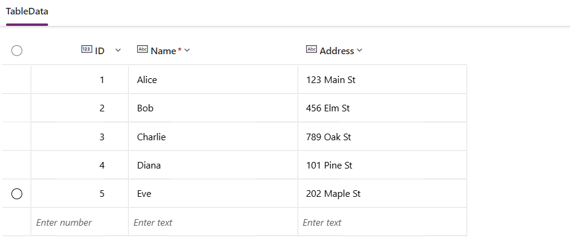

## Create a new SharePoint Team Site

We need to set up a new SharePoint site where the model-driven app will store its documents. Create a new SharePoint Team site; no additional configuration is needed at this stage. The SharePoint integration with the model-driven app will be automatically configured when set up.

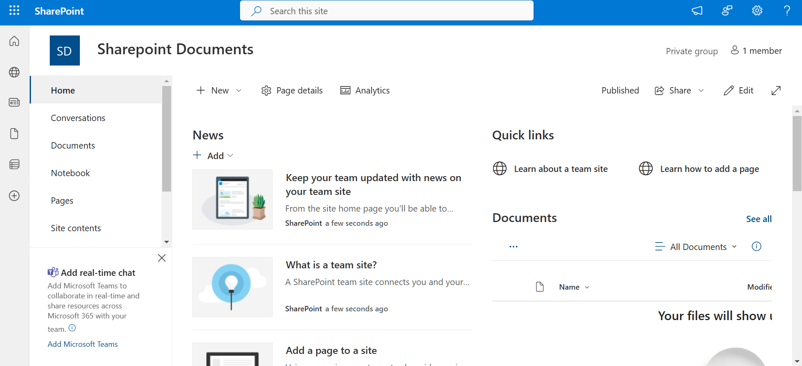

## Enabling SharePoint Integration in the Model-Driven App

To connect your SharePoint site to the model-driven app, follow these steps:

1. Open [Power portal](https://make.powerapps.com/) of your PowerApps account. and click on the gear icon located in the top-right corner of the screen.
From the dropdown menu, select Advanced Settings.

   

2. Now, the Dynamics 365 app will open in new tab. In that navigate to below location.

   > `Settings` -> `System` -> `Document Management.`

   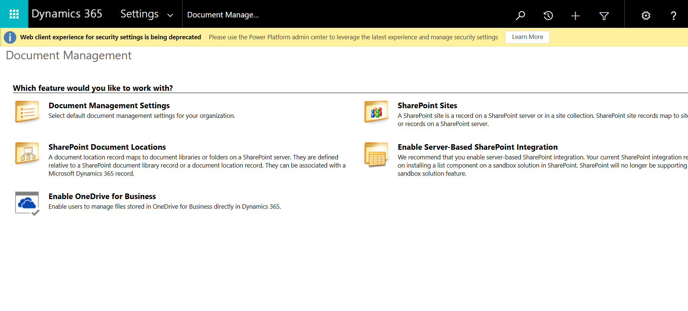

3. Next, we will enable SharePoint integration with Power Apps. Select the option to `Enable Server-Based SharePoint Integration`.

   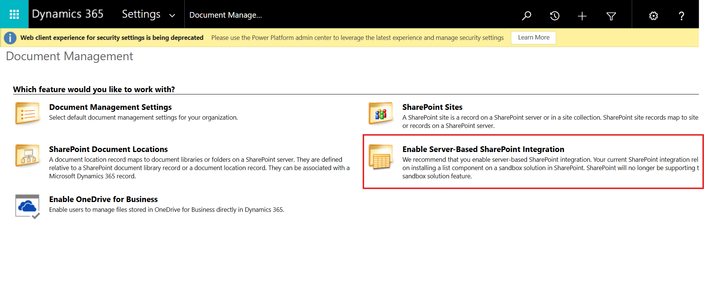

4. After clicking Enable Server-Based Integration, the first screen of the setup wizard will appear. Click the `Next` button.

5. On the Define Deployment screen, select Online, then click Next.

   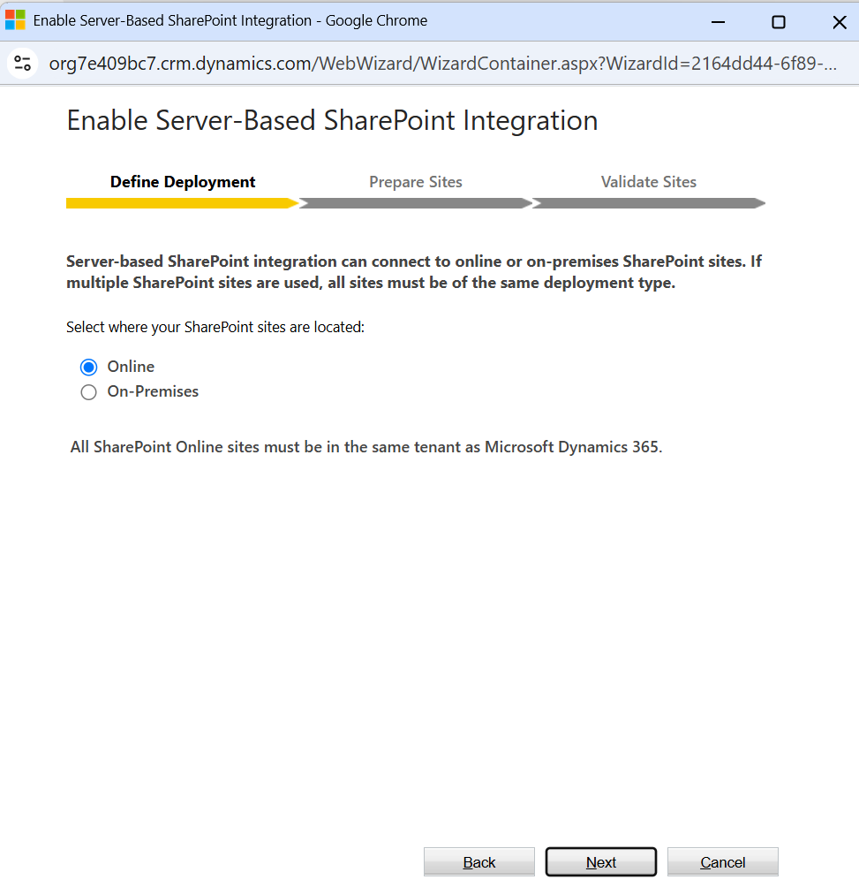

6. Enter the URL of the SharePoint site we created, then click the Next button.

   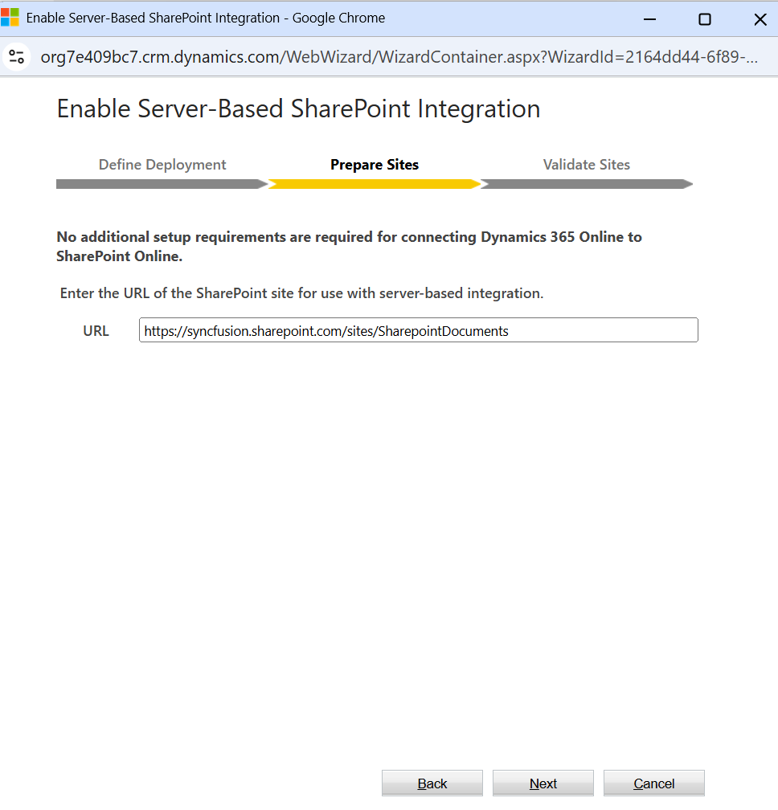

7. Wait for the site to be validated. Once the validation is complete, click `Enable`. A success message will appear, confirming that the integration has been successfully enabled. Finally, click the `Finish` button to complete the process.

   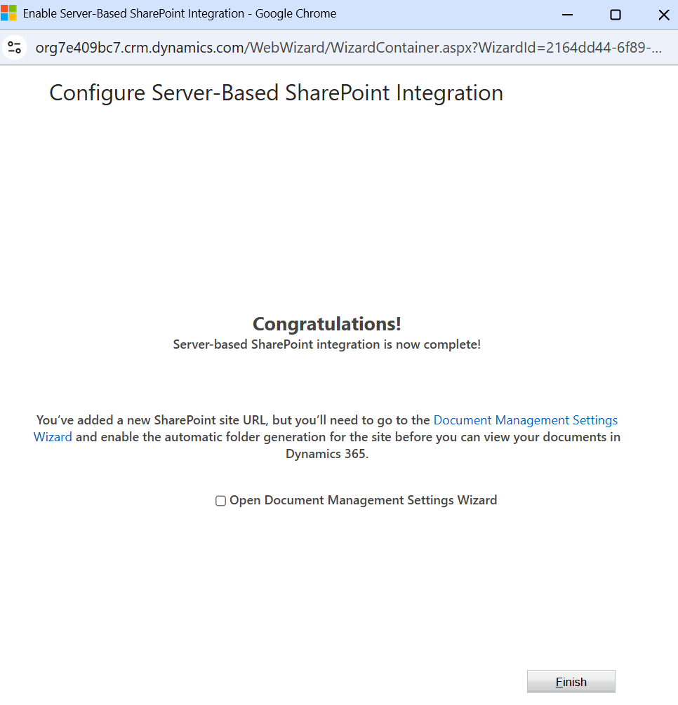

## Configuring Tables to Use a SharePoint Document Library

To specify which tables in the model-driven app will use a SharePoint document library, follow these steps: Each table will have its own document library. Open the `Document Management Settings` from the `Advanced Settings` menu to configure this.

   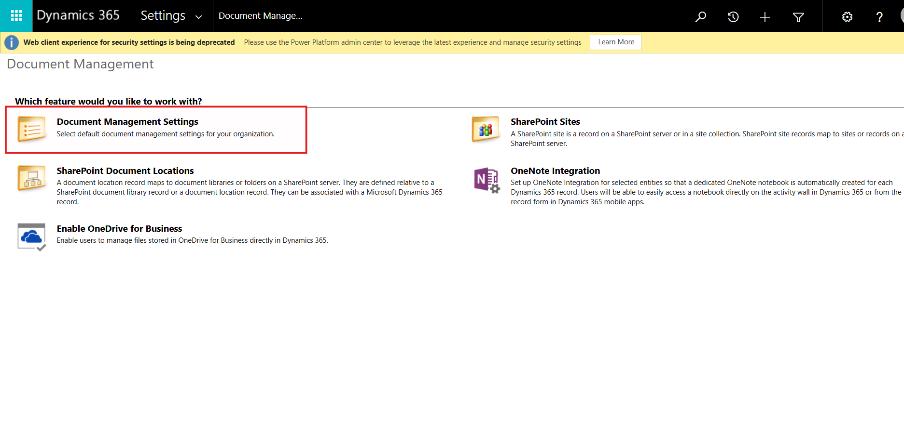

1. Select the `TableData` table. In this example, only one table is used, but you can select multiple tables if needed. Enter the `SharePoint site` URL in the corresponding field to link it with the document library.

   

2. Select `Next` on this screen. Do not enable Based On Entity unless you are using the Account or Contact tables.

   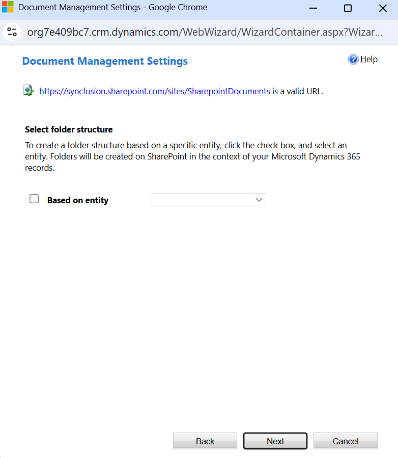

3. At this stage, the SharePoint document library will be created automatically by the integration. Wait for the process to complete. Once finished, the document library creation status page will display, showing the status as succeeded. Click the `Finish` button to complete the setup.

   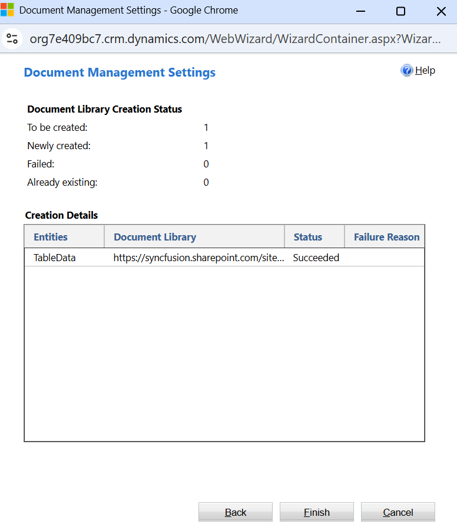

## Upload a File Using the Document Associated Grid

In this section, we will configure the model-driven app to store documents in SharePoint. Before proceeding, make sure you have created a Model-Driven App that renders the `TableData` form. For instructions on creating the Model-Driven App, refer to the [How to Create a Model-Driven App](./getting-started-with-model-driven-form.md#create-a-powerapps-model-driven-application)

1. Open the main form of any record in the `TableData` and navigating into a `Name` primary column data then click the related `Documents` table.

   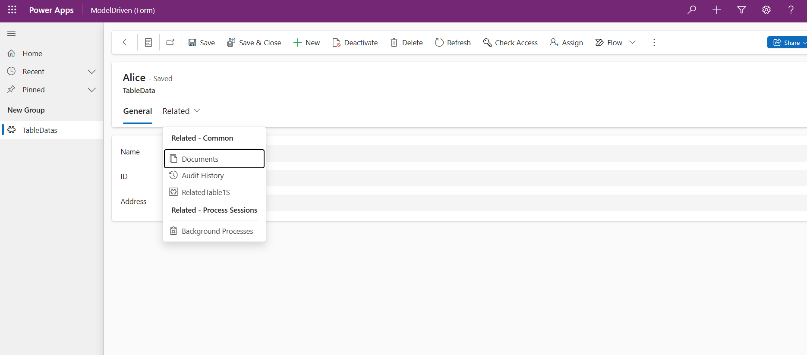

2. The Document Associated Grid will appear. Click on `Upload` to upload a file. Once the file is uploaded, click the `OK` button.

   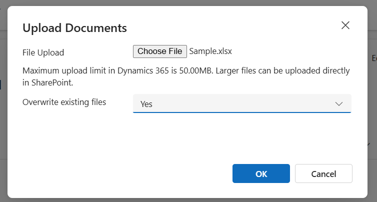

3. You can upload multiple files, and the uploaded files will appear in the grid.

   

## Find the Uploaded Document in SharePoint

The document uploaded through the model-driven app is stored in a SharePoint document library. To explore the file structure created behind the scenes, follow these steps:

- Open the Sharepoint site then navigate into the `Site Contents` -> `TableData`. Inside the folder, you will find the uploaded file.

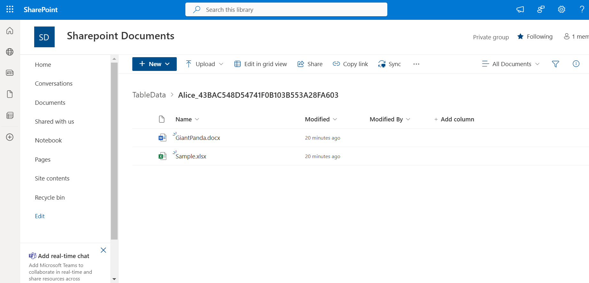

## Load the Sharepoint Document Library in the Filemanager component

In this section, we will configure the FileManager component to load the SharePoint Document Library. By doing so, you will be able to manage files directly within your model-driven app, accessing documents stored in SharePoint through the FileManager interface.

Follow the steps below to load the SharePoint document library into the FileManager component and enable seamless document management within your app.

1. First, open the previously created TableData Dataverse table. In the Data experiences pane to streamline data management. Locate the `Information` form with the **main** form type to define how users interact with and organize data effectively.

2. Within the left navigation pane of the `Information` form, locate the `Components` tab. Here, click on `Get more components` at the bottom of the tab.

   

3. A window will appear. Switch to the `Build by others` tab at the top and import the built code component named `SfFileManager` from the published solutions.

   

4. Create a new section in the form, opting for a `1-column tab` from the `popular` section. Rename this tab as **FileManager View** to clearly delineate its purpose. This tab will be utilized to render the FileManager code component.

5. From the `popular` section, add a **subgrid** to the first section. Enable the Show related records option, select the `Documents` table, and set the default view `All SharePoint Documents`.

   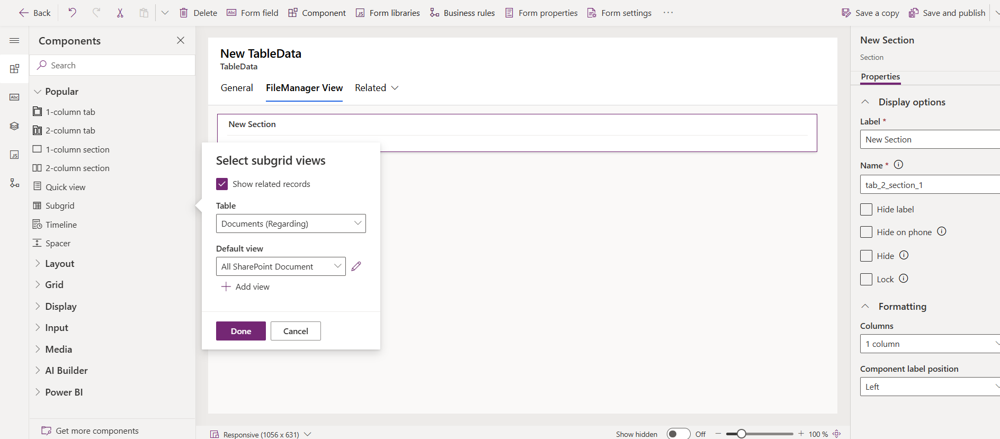

6. In the subgrid added, go to the right property pane under the `Components` section and add the `SfFileManager` component.

   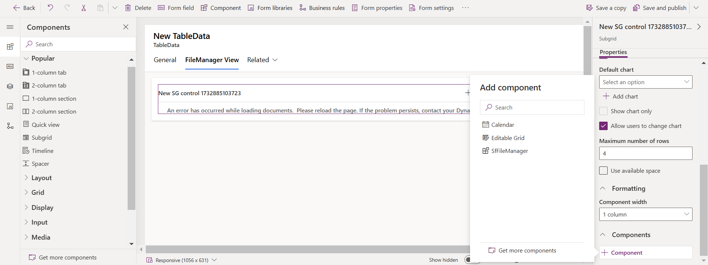

7. The output of the FileManager code component will appear as shown below. Click the `Save and publish` button at the top right corner of the PowerApps portal. This action commits the changes made to the form, ensuring that the Syncfusion PowerApps FileManager code component is now an integral part of the Dataverse table.

   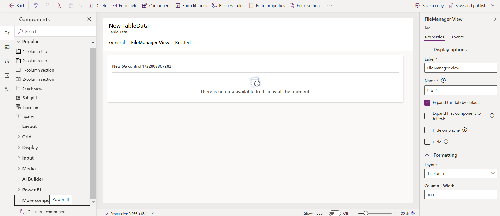

   > [!NOTE]
   > Initially, the Filemanager code component will display a blank screen in the form due to the absence of data. It will be loaded with available data in the published application.

8. Then create a model-driven application, follow the steps given in this link [How to Create a Model-Driven App](./getting-started-with-model-driven-form.md#create-a-powerapps-model-driven-application).

   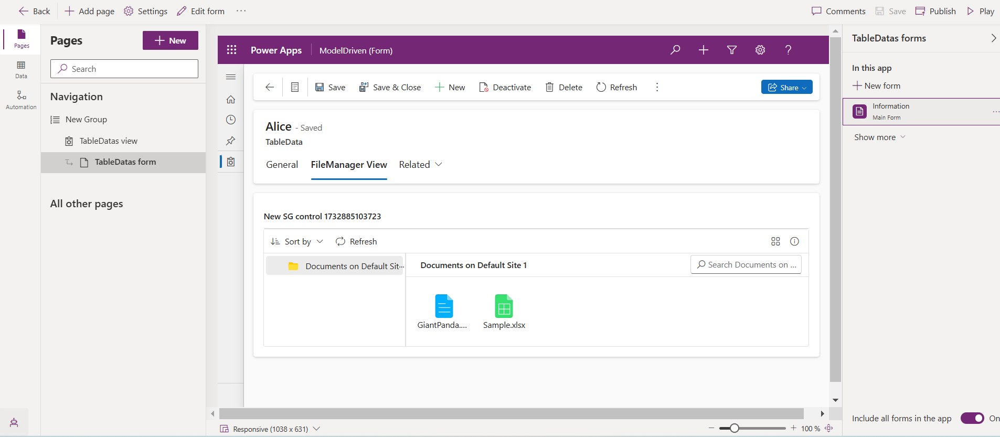

   > [!NOTE]
   > When adding a Dataverse table in Model-Driven Apps, select the previously created `TableData` table.

## Publish the Syncfusion PowerApps FileManager application

To publish the Syncfusion PowerApps FileManager model driven application in the production environment, click the `Publish` button at the top right corner of the PowerApps portal.

After publishing the application, click the `play` button to preview the published application. You can also share the published application with your users.

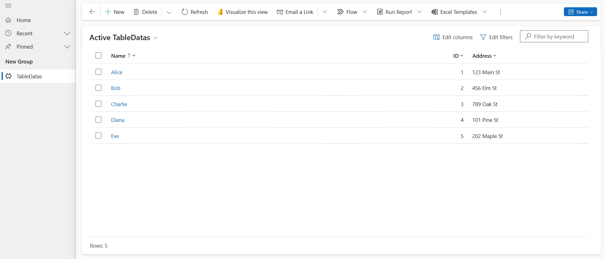

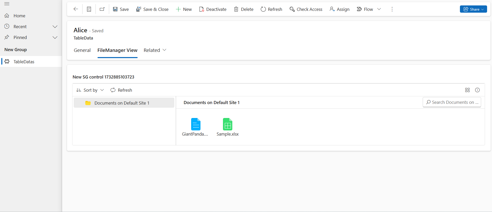

## See also

- [Getting Started with the Syncfusion PowerApps FileManager Code Component in Canvas Application](getting-started-with-canvas.md)

- [Getting Started with the Syncfusion PowerApps FileManager Code Component in Model-Driven Application (Form)](getting-started-with-model-driven-form.md)

- [Getting Started with the Syncfusion PowerApps FileManager Code Component in Model-Driven Application (Custom Pages)](getting-started-with-model-driven-custom-pages.md)

- [Getting Started with the Syncfusion PowerApps FileManager Code Component in PowerPages](getting-started-with-power-pages.md)
