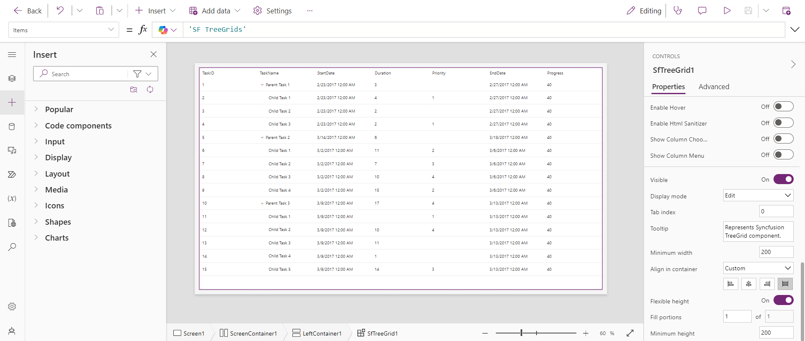
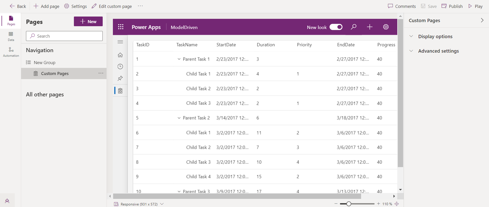
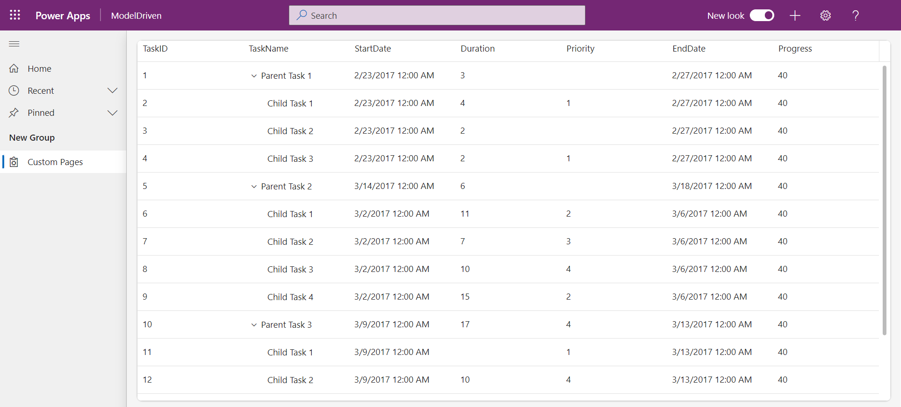

# Getting Started with Syncfusion PowerApps TreeGrid Code Component in Model-Driven Application (Custom Pages)

This article provides a step-by-step guide for setting up a PowerApps model-driven application with Custom pages (Canvas) and integrating the Syncfusion PowerApps TreeGrid code component.

PowerApps Model-Driven is a versatile platform for creating structured applications with a focus on data-centric design. It offers a guided approach, allowing users to build efficient business processes and workflows within a predefined data model.

## Prerequisites

- [Published Syncfusion PowerApps solution package](../../README.md#deploying-the-solution-package-in-the-powerapps-portal)

## Create a new Dataverse table

Syncfusion PowerApps TreeGrid code component requires data to be loaded from a data source. Follow the steps provided in [Create a new Dataverse table](../common/faq.md#how-to-create-a-new-dataverse-table) section to create a new table in Dataverse using the CSV in the TreeGrid code component [CSV data](../../components/treegrid/data/TreeGridData.csv) folder. Skip this step if you have an existing table with data.

When creating the Dataverse table using [CSV](../../components/treegrid/data/TreeGridData.csv) file, ensure the column names and data types match those in the table below:

| Column Name | DataType   |
|-------------|------------|
| TaskID      | Whole.none |
| TaskName    | SingleLine.Text |
| StartDate   | Date and Time data type column with the "Date Only" format.  |
| Duration    | Whole.none |
| Priority    | SingleLine.Text |
| EndDate     | Date and Time data type column with the "Date Only" format. |
| Progress    | Whole.none |
| ParentID    | Whole.none |

> [!NOTE]
> When setting up a Dataverse, make sure that the table columns are assigned the correct data types to prevent data loading issues in the TreeGrid code component.

## Create a PowerApps model-driven application

To create a model-driven application, follow the steps below:

1. In the [PowerApps portal](https://make.powerapps.com/), navigate to the `Apps` tab located in the left navigation pane and select the `Start with a page design` option.

    

2. Opt for the `Blank page with navigation` option and assign a meaningful name for your model-driven application. Proceed by clicking `create`.

    

3. The PowerApps platform will generate a blank model-driven application based on your specifications. You are now ready to start building your application.

    

4. To incorporate custom page into your application, click on the `Add Page` button. Select `Custom Page` & select `Create a new custom page` option. And assign a meaningful name for your custom page. Proceed by clicking `Add`.

    

    

5. The PowerApps platform will generate a blank custom page based on your specifications in a new tab. You are now ready to start building your custom page (Canvas).

6. Use any layouts & import the Syncfusion PowerApps TreeGrid code component to the custom page. Configure the data source for the TreeGrid code component by accessing the list of Dataverse tables. This step ensures that the TreeGrid code component is seamlessly connected to the relevant data. We can also use the optional [**TreeGridConfig.json**](../../components/treegrid/data/TreeGridConfig.json) JSON configuration to configure the TreeGrid code component.

7. Once the data is loaded, set the `IdMapping` property to the ID column, such as `TaskID` and the `TreeColumnIndex` property to `1` to ensure that the fields are correctly mapped and the sample renders properly. Also, customize the TreeGrid code component properties in the property pane.

    

    

    

    > [!NOTE]
    > Update the flexible height, width, and other properties of the TreeGrid code component to suit your application requirements. Also, refer to the [TreeGrid Canvas documentation](getting-started-with-canvas.md#import-syncfusion-powerapps-chart-code-component-into-canvas-application) for additional information.

8. Save the custom page and publish the changes to add it in the model-driven application.

9. After that in the previously created model-driven application, click on the `Publish` button to make the changes live.

    

> [!NOTE]
> For more information, refer to the [Create an blank Model-Driven app in PowerApps](https://learn.microsoft.com/en-us/power-apps/maker/model-driven-apps/build-app-three-steps).

## Publish the Syncfusion PowerApps TreeGrid application

After publishing the application, click the `play` button to preview the published application. You can also share the published application with your users.

## See Also

- [Getting Started with the Syncfusion PowerApps TreeGrid Code Component in Canvas Application](getting-started-with-canvas.md)

- [Getting Started with the Syncfusion PowerApps TreeGrid Code Component in Model-Driven Application (Form)](getting-started-with-model-driven-form.md)

- [Getting Started with the Syncfusion PowerApps TreeGrid Code Component in PowerPages](getting-started-with-power-pages.md)
